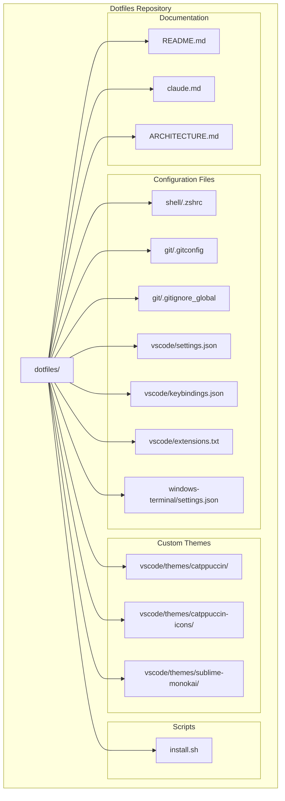
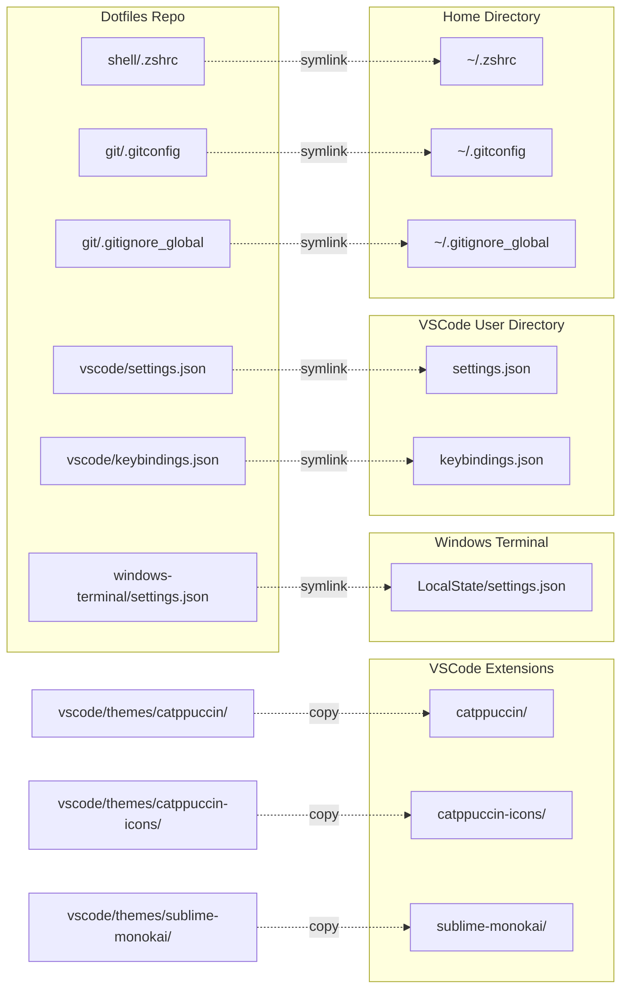
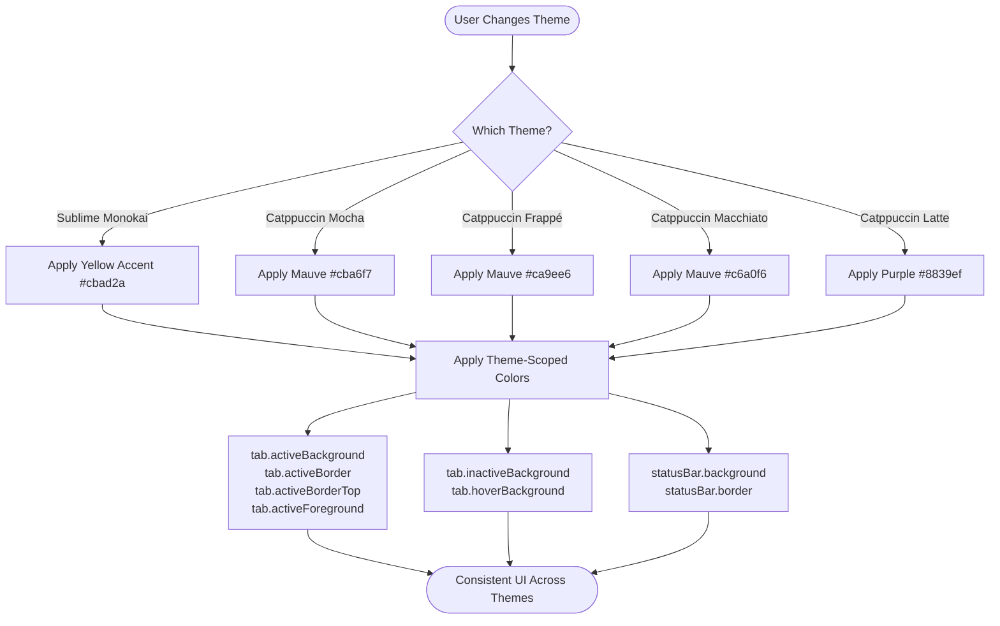
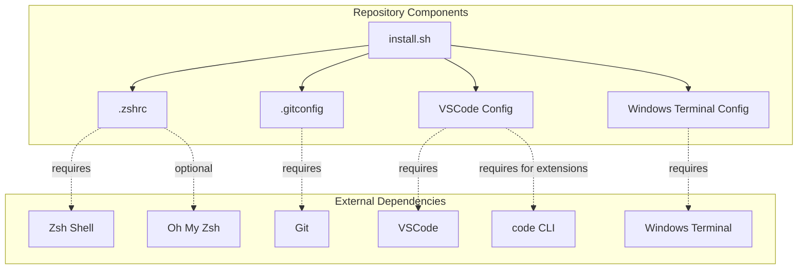
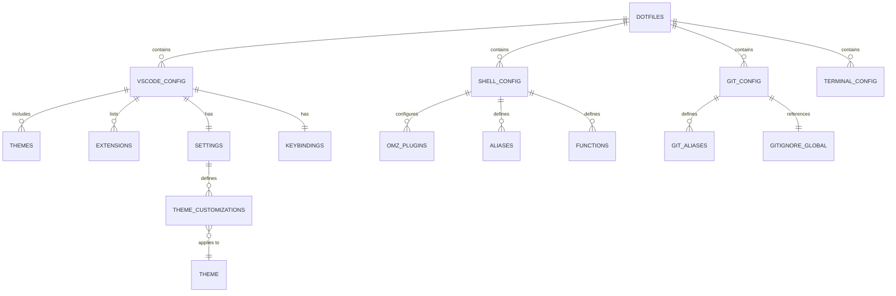

# Dotfiles Architecture

This document visualizes the structure and relationships within this dotfiles repository.

## Repository Structure



## Installation Flow

```mermaid
flowchart TD
    START([New Machine]) --> CLONE[Clone Repository]
    CLONE --> RUN_INSTALL[Run install.sh]

    RUN_INSTALL --> CHOICE{Select Installation Type}

    CHOICE -->|1. Everything| ALL[Install All Configs]
    CHOICE -->|2. Shell Only| SHELL_ONLY[Install Shell Config]
    CHOICE -->|3. Git Only| GIT_ONLY[Install Git Config]
    CHOICE -->|4. VSCode Only| VS_ONLY[Install VSCode Config]
    CHOICE -->|5. Terminal Only| TERM_ONLY[Install Terminal Config]
    CHOICE -->|6. Custom| CUSTOM[Custom Selection]

    ALL --> SHELL_INSTALL[Symlink .zshrc]
    ALL --> GIT_INSTALL[Symlink .gitconfig & .gitignore_global]
    ALL --> VS_INSTALL[Install VSCode]
    ALL --> TERM_INSTALL[Symlink Windows Terminal settings]

    SHELL_ONLY --> SHELL_INSTALL
    GIT_ONLY --> GIT_INSTALL
    VS_ONLY --> VS_INSTALL
    TERM_ONLY --> TERM_INSTALL
    CUSTOM --> SHELL_INSTALL
    CUSTOM --> GIT_INSTALL
    CUSTOM --> VS_INSTALL
    CUSTOM --> TERM_INSTALL

    VS_INSTALL --> VS_SYMLINK[Symlink settings.json & keybindings.json]
    VS_SYMLINK --> VS_EXT_INSTALL[Install Extensions from extensions.txt]
    VS_EXT_INSTALL --> VS_THEME_INSTALL[Copy Custom Themes to ~/.vscode/extensions/]

    SHELL_INSTALL --> SHELL_MANUAL{Manual Steps Needed}
    SHELL_MANUAL --> INSTALL_ZSH[sudo apt install zsh]
    INSTALL_ZSH --> CHSH[chsh -s $\(which zsh\)]
    CHSH --> INSTALL_OMZ[Install Oh My Zsh]

    GIT_INSTALL --> GIT_MANUAL{Manual Steps Needed}
    GIT_MANUAL --> GIT_USER[Configure Git user.name & user.email]

    SHELL_MANUAL --> COMPLETE([Installation Complete])
    GIT_MANUAL --> COMPLETE
    VS_THEME_INSTALL --> COMPLETE
    TERM_INSTALL --> COMPLETE
```

## File Symlink Mapping



## VSCode Theme Customization Flow



## Dependency Graph



## Configuration Relationships


